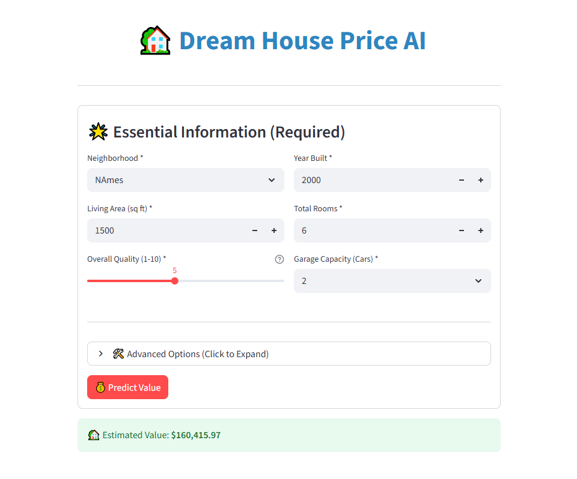
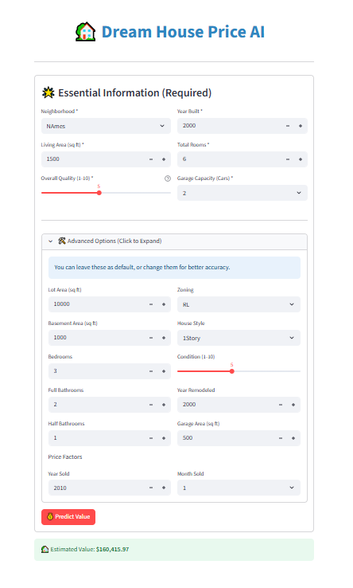

# 🏡 End-to-End House Price Prediction

A full-stack Machine Learning project to predict residential house prices using advanced regression techniques. The project includes data processing, an optimized XGBoost model, and an interactive web application deployed using Streamlit.

## 🎯 Objective
To build a robust predictive model that estimates house prices based on 79 explanatory variables (such as square footage, location, year built, and finish quality) and deploy it as a user-friendly tool for real estate valuation.

## 🖼️ Project Demo
Here is a preview of the application:




## 📂 Dataset
- **Source:** [Kaggle - House Prices: Advanced Regression Techniques](https://www.kaggle.com/c/house-prices-advanced-regression-techniques/data)
- **Data Size:** 1460 Training examples, 81 Features.
- **Key Features:** `OverallQual`, `GrLivArea`, `YearBuilt`, `TotalBsmtSF`, `Neighborhood`.

## 🧰 Tech Stack
- **Language:** Python 3.9+
- **Data Manipulation:** Pandas, NumPy
- **Visualization:** Matplotlib, Seaborn
- **Machine Learning:** Scikit-Learn, XGBoost (Hyperparameter Tuned)
- **Deployment:** Streamlit
- **Model Saving:** Joblib

## 📊 Model Performance
After extensive EDA and feature engineering, the final **XGBoost** model achieved:
- **R² Score:** 0.93 (Test Set)
- **RMSE:** ~$21,000 (approx. 10% margin of error on average)
- **Validation:** 3-Fold Cross-Validation

## 🚀 Project Structure
```text
House-Price-Prediction/
│
├── data/
│   ├── raw/                # Original dataset
│   └── processed/          # Cleaned data for training
│
├── notebooks/
│   ├── 01_EDA.ipynb        # Exploratory Data Analysis
│   ├── 02_Preprocessing.ipynb
│   ├── 03_Modeling.ipynb   # Baseline Models
│   └── 04_Model_Tuning.ipynb # Hyperparameter Tuning
│
├── src/
│   ├── preprocessing.py    # Modular feature engineering logic
│   └── train_pipeline.py   # Script to train and save the model
│
├── models/
│   └── final_model.joblib  # The saved XGBoost model
|
├── images/
│   ├── demo_01.png
|   └── demo_02.png
│
├── app.py                  # Streamlit Web Application
├── requirements.txt        # Python dependencies
└── README.md               # Project Documentation
🛠️ How to Run Locally
Clone the Repository

Bash

git clone [https://github.com/syedibrahimdev/Dream-House-Price-AI.git](https://github.com/syedibrahimdev/Dream-House-Price-AI.git)
cd House-Price-Prediction
Install Dependencies

Bash

pip install -r requirements.txt
Run the App

Bash

streamlit run app.py
The app will open in your browser at http://localhost:8501.

📈 Key Steps Taken
Data Cleaning: Handled missing values (LotFrontage, Garage, etc.) and removed outliers (e.g., houses > 4000 sqft with low price).

Feature Engineering: Created new features like TotalBath, HouseAge, and TotalPorchSF to capture hidden patterns.

Pipeline Construction: Built a Scikit-Learn Pipeline with ColumnTransformer to handle scaling and encoding automatically.

Model Tuning: Used RandomizedSearchCV to optimize XGBoost parameters (n_estimators=1500, learning_rate=0.01).

🤝 Contributing
Feel free to fork this repo and submit Pull Requests.

Author: Syed Ibrahim Ahmed